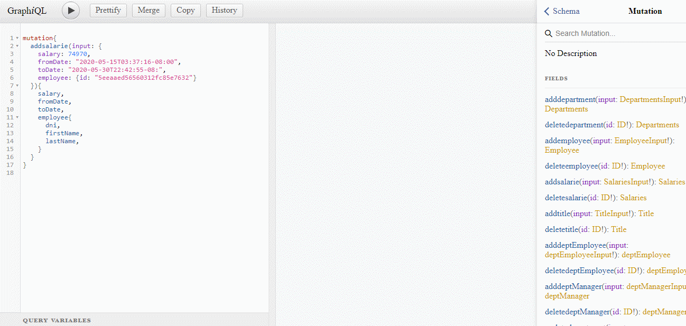

# Endpoint

http://localhost:3000/graphql

# Run

Start mongodb with replica sets

    run-rs

Start node app

    npm run dev

Extras

To interact with mongodb you can use mongo-express

    mongo-express -U "mongodb://localhost:27017,localhost:27018,localhost:27019/example?replicaSet=rs"

## Date input format

    "2020-6-17T20:50:18.000Z"

